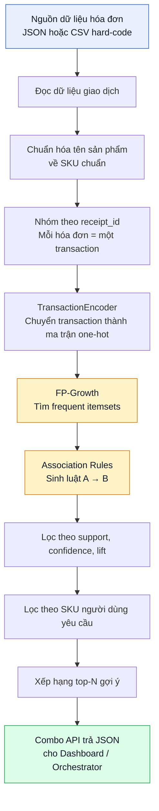
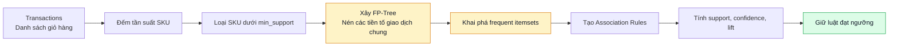
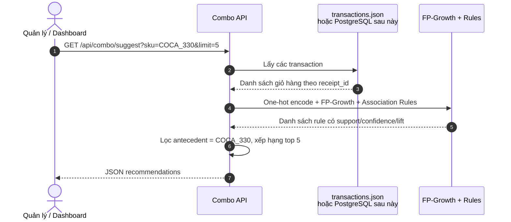
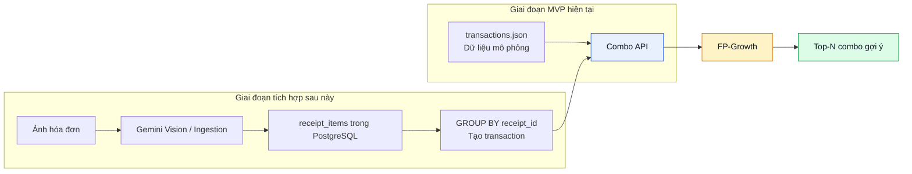

# COMBO RECOMMENDATION — LUỒNG THUẬT TOÁN FP-GROWTH

## 1. Mục tiêu module

Module **Combo Recommendation** phân tích các sản phẩm cùng xuất hiện trong một hóa đơn để đề xuất sản phẩm nên bán kèm.

Ví dụ: nếu nhiều hóa đơn cùng có **Coca-Cola** và **Mì Hảo Hảo**, hệ thống tạo luật:

```text
Coca-Cola → Mì Hảo Hảo
```

Ý nghĩa nghiệp vụ: khi khách đã mua Coca-Cola, cửa hàng có thể gợi ý Mì Hảo Hảo, tạo combo khuyến mãi hoặc bố trí hai sản phẩm gần nhau.

> Đây là **Market Basket Analysis / Association Rule Mining**: gợi ý dựa trên hành vi giao dịch ở cấp hóa đơn. Hệ thống không phải Content-based Recommendation và chưa phải gợi ý cá nhân hóa theo khách hàng, vì dữ liệu hiện chưa có `customer_id`.

---

## 2. Phạm vi MVP

### Đầu vào

Trong giai đoạn đầu, dùng file JSON hoặc CSV chứa dữ liệu hóa đơn mô phỏng. Mỗi hóa đơn là một "giỏ hàng" gồm các SKU đã được chuẩn hóa.

```json
[
  {
    "receipt_id": "HD001",
    "items": ["COCA_330", "HAOHAO_TOM", "OISHI_SNACK"]
  },
  {
    "receipt_id": "HD002",
    "items": ["COCA_330", "HAOHAO_TOM"]
  },
  {
    "receipt_id": "HD003",
    "items": ["PEPSI_330", "OISHI_SNACK"]
  }
]
```

### Đầu ra

Danh sách sản phẩm nên gợi ý mua kèm theo SKU đầu vào, kèm các chỉ số có thể giải thích.

```json
{
  "input_sku": "COCA_330",
  "algorithm": "fp_growth_association_rules",
  "recommendations": [
    {
      "sku": "HAOHAO_TOM",
      "product_name": "Mì Hảo Hảo tôm chua cay",
      "support": 0.25,
      "confidence": 0.62,
      "lift": 1.55
    }
  ]
}
```

### Ngoài phạm vi MVP

- Gợi ý cá nhân hóa theo từng khách hàng.
- Collaborative Filtering.
- Tự động trích xuất ảnh hóa đơn bằng Gemini Vision.
- Nạp dữ liệu từ PostgreSQL thật.
- Tối ưu chạy batch hoặc lưu bảng luật khi có dữ liệu lớn.

---

## 3. Luồng dữ liệu tổng thể



---

## 4. Diễn giải chi tiết từng bước

| Bước | Xử lý | Ví dụ | Kết quả |
|---:|---|---|---|
| 1 | Đọc dữ liệu hóa đơn | `HD001: COCA_330, HAOHAO_TOM, OISHI_SNACK` | Danh sách giao dịch thô |
| 2 | Chuẩn hóa tên sản phẩm | `Coca Cola 330ml` → `COCA_330` | Không chia sai một sản phẩm thành nhiều mã |
| 3 | Tạo transaction | Mỗi `receipt_id` là một giỏ hàng | `['COCA_330', 'HAOHAO_TOM']` |
| 4 | One-hot encoding | SKU có mặt = `True`, không có = `False` | Ma trận transaction × product |
| 5 | FP-Growth | Tìm nhóm SKU xuất hiện đủ thường xuyên | `{COCA_330, HAOHAO_TOM}` |
| 6 | Association Rules | Tạo luật có hướng từ frequent itemset | `COCA_330 → HAOHAO_TOM` |
| 7 | Lọc rule | Kiểm tra `support`, `confidence`, `lift` | Loại rule hiếm hoặc ngẫu nhiên |
| 8 | Xếp hạng kết quả | Ưu tiên lift, sau đó confidence | Top 5 sản phẩm mua kèm |
| 9 | API trả kết quả | `GET /api/combo/suggest?sku=COCA_330` | JSON cho dashboard/orchestrator |

---

## 5. Vì sao mỗi hóa đơn phải là một transaction?

Giả sử có dữ liệu:

```text
HD001: Coca-Cola, Mì Hảo Hảo, Snack Oishi
HD002: Coca-Cola, Mì Hảo Hảo
HD003: Pepsi, Snack Oishi
```

Dữ liệu đúng cho thuật toán là:

```python
transactions = [
    ["COCA_330", "HAOHAO_TOM", "OISHI_SNACK"],
    ["COCA_330", "HAOHAO_TOM"],
    ["PEPSI_330", "OISHI_SNACK"],
]
```

FP-Growth dựa vào việc các sản phẩm **đồng xuất hiện trong cùng giỏ hàng**. Vì vậy không được tách mỗi dòng sản phẩm thành một transaction độc lập:

```python
# Sai: mất quan hệ mua chung.
transactions = [
    ["COCA_330"],
    ["HAOHAO_TOM"],
    ["OISHI_SNACK"],
]
```

---

## 6. FP-Growth hoạt động như thế nào?

FP-Growth là thuật toán khai phá tập phổ biến (*frequent itemsets*). Nó tìm những nhóm sản phẩm xuất hiện cùng nhau đủ nhiều lần trong các hóa đơn.

Ví dụ:

```text
HD001: Coca-Cola, Mì Hảo Hảo
HD002: Coca-Cola, Mì Hảo Hảo
HD003: Coca-Cola, Snack Oishi
HD004: Coca-Cola, Mì Hảo Hảo
```

Nếu đặt `min_support = 0.5`, tập:

```text
{Coca-Cola, Mì Hảo Hảo}
```

xuất hiện trong 3/4 hóa đơn, tức support = `0.75`, nên được giữ lại.

Từ tập phổ biến này, Association Rules tạo hai luật có hướng:

```text
Coca-Cola → Mì Hảo Hảo
Mì Hảo Hảo → Coca-Cola
```

Hai luật này không nhất thiết có cùng độ mạnh, vì số lần Coca-Cola xuất hiện có thể khác số lần Mì Hảo Hảo xuất hiện.

### Luồng xử lý bên trong thuật toán



### Lý do chọn FP-Growth thay vì Apriori

| Tiêu chí | Apriori | FP-Growth |
|---|---|---|
| Cách tìm tập phổ biến | Sinh nhiều tổ hợp ứng viên rồi kiểm tra | Nén dữ liệu bằng FP-Tree rồi khai phá |
| Khi có nhiều SKU/hóa đơn | Số tổ hợp tăng nhanh, dễ chậm | Hiệu quả hơn |
| Phù hợp MVP | Có thể dùng | **Được chọn làm chính** |
| Mức độ giải thích | Dễ | Dễ, đầu ra đều là association rules |

FP-Growth không tạo ra kết quả khác bản chất so với Apriori, nhưng phù hợp hơn khi lượng hóa đơn tăng vì tránh sinh quá nhiều candidate itemsets.

---

## 7. Ba chỉ số đánh giá luật kết hợp

Ví dụ xét luật:

```text
COCA_330 → HAOHAO_TOM
```

Giả sử có 100 hóa đơn:

- 25 hóa đơn có Coca-Cola.
- 30 hóa đơn có Mì Hảo Hảo.
- 15 hóa đơn có cả hai sản phẩm.

### 7.1. Support — combo xuất hiện có phổ biến không?

\[
Support(A \rightarrow B) = \frac{Số\ hóa\ đơn\ chứa\ cả\ A\ và\ B}{Tổng\ số\ hóa\ đơn}
\]

\[
Support(Coca-Cola \rightarrow Mì\ Hảo\ Hảo) = \frac{15}{100} = 0.15
\]

Combo xuất hiện trong 15% toàn bộ hóa đơn. Support giúp loại các luật quá hiếm.

### 7.2. Confidence — khách đã mua A có thường mua B không?

\[
Confidence(A \rightarrow B) = \frac{Support(A \cup B)}{Support(A)}
\]

\[
Confidence(Coca-Cola \rightarrow Mì\ Hảo\ Hảo) = \frac{15}{25} = 0.60
\]

Diễn giải: **60% hóa đơn có Coca-Cola cũng có Mì Hảo Hảo**.

### 7.3. Lift — mối liên hệ có thực sự đáng chú ý không?

\[
Lift(A \rightarrow B) = \frac{Confidence(A \rightarrow B)}{Support(B)}
\]

\[
Lift(Coca-Cola \rightarrow Mì\ Hảo\ Hảo) = \frac{0.60}{0.30} = 2.0
\]

Diễn giải: khi khách mua Coca-Cola, khả năng mua Mì Hảo Hảo cao **gấp 2 lần bình thường**.

| Giá trị lift | Diễn giải |
|---:|---|
| `< 1` | Hai sản phẩm có xu hướng ít đi cùng nhau |
| `= 1` | Không có liên hệ đáng kể |
| `> 1` | Có xu hướng mua cùng nhau |
| `≥ 1.2` | Có thể cân nhắc làm combo |
| `≥ 2.0` | Quan hệ mạnh, nên ưu tiên xem xét |

> Không chỉ dùng confidence. Một sản phẩm rất phổ biến có thể tạo confidence cao với nhiều sản phẩm, nhưng lift xấp xỉ 1 thì không phải combo có giá trị.

---

## 8. Các ngưỡng đề xuất cho MVP

| Tham số | Giá trị khởi tạo | Ý nghĩa |
|---|---:|---|
| `min_support` | `0.10` | Combo phải xuất hiện trong ít nhất 10% hóa đơn mô phỏng |
| `min_confidence` | `0.40` | Ít nhất 40% khách mua A cũng mua B |
| `min_lift` | `1.20` | Khả năng mua B khi đã mua A cao hơn mức bình thường ít nhất 20% |
| `limit` | `5` | Chỉ trả top 5 gợi ý để dễ dùng trên dashboard |

Với dữ liệu lớn hơn, có thể giảm `min_support` xuống `0.02–0.05`. Không nên giữ ngưỡng cố định mà không kiểm tra số lượng rule sinh ra.

---

## 9. Flow API

### Endpoint đề xuất

```http
GET /api/combo/suggest?sku=COCA_330&limit=5
```

### Luồng request/response



### JSON response đề xuất

```json
{
  "input_sku": "COCA_330",
  "algorithm": "fp_growth_association_rules",
  "data_source": "mock_transactions_json",
  "total_transactions": 120,
  "thresholds": {
    "min_support": 0.1,
    "min_confidence": 0.4,
    "min_lift": 1.2
  },
  "recommendations": [
    {
      "sku": "HAOHAO_TOM",
      "product_name": "Mì Hảo Hảo tôm chua cay",
      "support": 0.25,
      "confidence": 0.62,
      "lift": 1.55
    }
  ]
}
```

---

## 10. Pseudocode của module

```python
# 1. Đọc transactions từ JSON/CSV.
transactions = load_transactions()

# 2. Mã hóa mỗi transaction thành ma trận one-hot.
encoded_transactions = transaction_encoder(transactions)

# 3. Khai phá nhóm sản phẩm phổ biến.
frequent_itemsets = fpgrowth(
    encoded_transactions,
    min_support=0.10,
)

# 4. Sinh luật kết hợp và lọc ngưỡng.
rules = association_rules(frequent_itemsets, metric="confidence", min_threshold=0.40)
rules = rules[rules["lift"] >= 1.20]

# 5. Chỉ giữ luật dạng 1 SKU → 1 SKU, có SKU đầu vào ở vế trái.
rules = filter_single_item_rules(rules, input_sku="COCA_330")

# 6. Sắp xếp và trả top-N.
recommendations = rules.sort_values(
    by=["lift", "confidence", "support"],
    ascending=False,
).head(5)
```

---

## 11. Các rủi ro và cách xử lý

| Rủi ro | Hậu quả | Cách xử lý ở MVP |
|---|---|---|
| Tên cùng sản phẩm nhưng khác cách ghi | Support bị chia nhỏ, không tìm được combo | Dùng SKU chuẩn trong dữ liệu mô phỏng |
| Ít hóa đơn | Luật không ổn định | Ghi rõ dữ liệu chỉ dùng chứng minh kỹ thuật; kiểm tra tối thiểu 50 transaction |
| Sản phẩm quá phổ biến như túi nylon | Gợi ý vô nghĩa nhưng confidence cao | Lọc lift, blacklist SKU không có giá trị kinh doanh |
| Rule quá phức tạp | Dashboard khó hiển thị | Chỉ dùng luật 1 SKU → 1 SKU trong MVP |
| Chạy lại thuật toán ở mỗi request khi data lớn | API chậm | MVP chấp nhận; sau này chạy batch và lưu `combo_rules` |

---

## 12. Kế hoạch thay thế dữ liệu khi hệ thống hoàn thiện



Điểm cần nhấn mạnh: khi chuyển từ dữ liệu JSON mô phỏng sang PostgreSQL, **thuật toán và API contract không thay đổi**. Chỉ thay tầng cung cấp `transactions`.

---

## 13. Kết luận trình bày trong nhóm

> Module Combo Recommendation sử dụng FP-Growth và Association Rule Mining để tìm sản phẩm thường được mua cùng nhau trong từng hóa đơn. Mỗi hóa đơn được xem là một transaction gồm các SKU chuẩn hóa. Hệ thống sinh luật dạng A → B, sau đó dùng support, confidence và lift để loại rule hiếm hoặc ngẫu nhiên, rồi trả về top-N sản phẩm nên gợi ý mua kèm. Ở MVP, dữ liệu là JSON mô phỏng; khi luồng ingestion hoàn thiện, chỉ cần thay nguồn dữ liệu bằng `receipt_items` nhóm theo `receipt_id`, không cần thay thuật toán.
