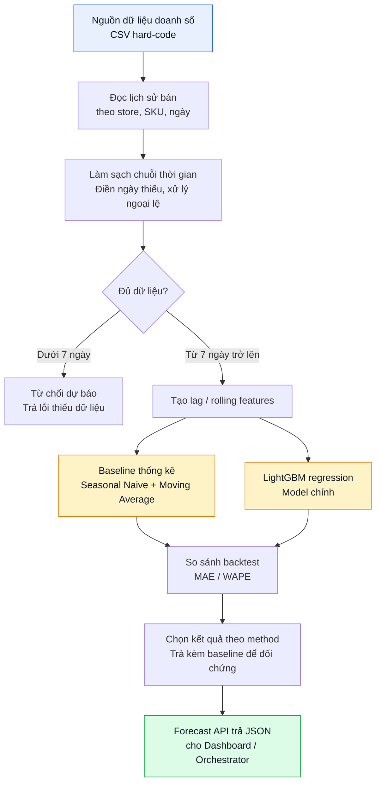
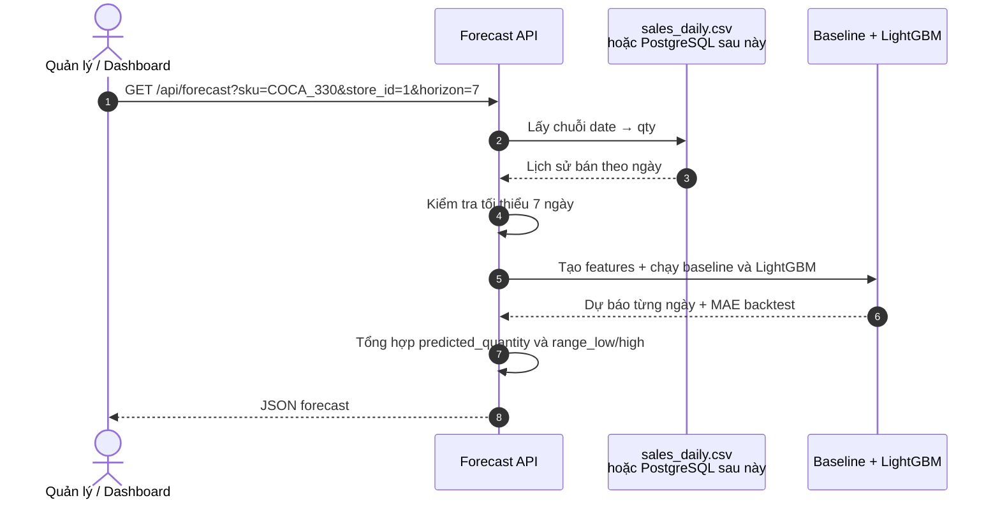
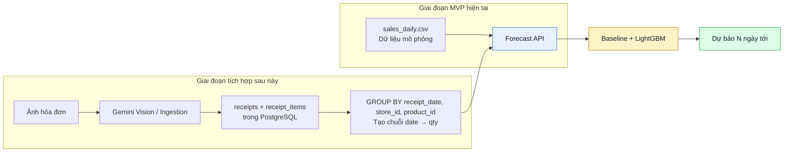

# FORECAST — LUỒNG DỰ BÁO NHU CẦU BÁN HÀNG

## 1. Mục tiêu module

Module **Forecast** dự báo lượng bán của từng sản phẩm tại từng cửa hàng trong N ngày tới, từ đó gợi ý lượng cần nhập để tránh thiếu hàng hoặc tồn kho.

Ví dụ: với Coca-Cola lon 330ml tại cửa hàng Quận 1, hệ thống trả lời:

```text
7 ngày tới dự kiến bán khoảng 232 lon,
khoảng dao động 195–270 lon.
```

> Đây là bài toán **dự báo chuỗi thời gian (time-series forecasting)** ở cấp `(store, SKU, ngày)`. Module không dự báo doanh thu toàn chuỗi chung chung, mà dự báo theo từng sản phẩm để phục vụ nhập hàng.

---

## 2. Phạm vi MVP

### Đầu vào

Trong giai đoạn đầu, dùng file CSV chứa doanh số mô phỏng theo ngày. Mỗi dòng là số lượng bán của một `(store, SKU)` trong một ngày.

```csv
date,store_id,sku,qty
2026-07-01,1,COCA_330,22
2026-07-02,1,COCA_330,25
2026-07-03,1,COCA_330,21
2026-07-04,1,COCA_330,34
2026-07-05,1,COCA_330,38
```

### Đầu ra

Dự báo tổng lượng bán trong `horizon` ngày tới, kèm dự báo từng ngày và khoảng dao động.

```json
{
  "sku": "COCA_330",
  "store_id": 1,
  "horizon_days": 7,
  "method": "lightgbm",
  "predicted_quantity": 232.5,
  "daily": [30.1, 31.5, 29.8, 33.2, 36.4, 38.7, 32.8],
  "range_low": 195.0,
  "range_high": 270.0
}
```

### Ngoài phạm vi MVP

- Dự báo theo giờ hoặc theo ca bán.
- Tối ưu giá bán hoặc khuyến mãi tự động.
- Dự báo cho sản phẩm hoàn toàn mới, chưa có lịch sử.
- Tích hợp PostgreSQL thật và Orchestrator.
- Dùng Prophet hoặc Deep Learning.

---

## 3. Luồng dữ liệu tổng thể



---

## 4. Diễn giải chi tiết từng bước

| Bước | Xử lý | Ví dụ | Kết quả |
|---:|---|---|---|
| 1 | Đọc lịch sử bán | `COCA_330` tại cửa hàng 1, 90 ngày | Chuỗi `date → qty` |
| 2 | Làm sạch chuỗi | Điền ngày thiếu bằng 0 hoặc nội suy | Chuỗi liên tục, không thủng ngày |
| 3 | Kiểm tra độ dài | `len(history) < 7` thì từ chối | Tránh dự báo từ dữ liệu quá ít |
| 4 | Tạo feature | `lag_1`, `lag_7`, `roll_mean_7`, `weekday` | Bảng train cho LightGBM |
| 5 | Chạy baseline | Seasonal Naive 7 ngày, MA7 | Kết quả đối chứng |
| 6 | Chạy LightGBM | Train regression theo bảng feature | Dự báo từng ngày |
| 7 | Backtest | Rolling-origin trên 14–30 ngày cuối | MAE, WAPE của từng phương pháp |
| 8 | API trả kết quả | `GET /api/forecast?sku=COCA_330` | JSON dự báo và khoảng dao động |

---

## 5. Vì sao phải biến chuỗi thời gian thành bảng?

LightGBM không đọc trực tiếp chuỗi ngày tháng. Cần chuyển mỗi ngày thành một dòng gồm các đặc trưng lấy từ quá khứ.

Ví dụ lịch sử:

```text
01/07: 22
02/07: 25
03/07: 21
04/07: 34
05/07: 38
06/07: 36
07/07: 30
08/07: 32
```

Dòng train cho ngày `08/07` có thể là:

```text
lag_1 = 30
lag_7 = 22
roll_mean_7 = 29.7
roll_std_7 = 6.1
weekday = Tuesday
is_weekend = 0
target = 32
```

Nhờ đó LightGBM học được các mẫu như:

```text
Cuối tuần bán cao hơn ngày thường.
Ngày sau lễ thường giảm.
Sản phẩm đang trong xu hướng tăng 7 ngày gần đây.
```

---

## 6. Hai phương pháp trong MVP

### 6.1. Baseline thống kê

Baseline dùng để trả lời câu hỏi:

> Model ML có hơn được cách đoán đơn giản hay không?

Các baseline nên có:

```text
Naive: ngày mai bán bằng hôm nay.
Seasonal Naive 7 ngày: ngày mai bán bằng đúng thứ này tuần trước.
Moving Average 7 ngày: trung bình 7 ngày gần nhất.
```

Ưu điểm:

- Chạy được với 7–30 ngày dữ liệu.
- Không cần train.
- Rất dễ giải thích khi bảo vệ.
- Nếu LightGBM không thắng baseline thì kết quả chưa đáng tin.

### 6.2. Model chính: LightGBM regression

LightGBM học quan hệ giữa các lag/rolling features và lượng bán tương lai.

Feature đề xuất:

```text
lag_1, lag_2, lag_3
lag_7, lag_14
roll_mean_7, roll_mean_14
roll_std_7
weekday, month
is_weekend, is_holiday
price, promotion_flag (nếu có)
store_id, sku (mã hóa category nếu train chung nhiều SKU)
```

Ưu điểm so với Prophet ở giai đoạn MVP:

- Train và inference nhanh.
- Một model có thể dùng chung cho nhiều SKU/cửa hàng.
- Dễ thêm giá, khuyến mãi, lễ, thứ trong tuần.
- Không yêu cầu chuỗi 6–12 tháng mới chạy ổn định.

### 6.3. Vì sao chưa dùng Prophet?

| Tiêu chí | Baseline + LightGBM | Prophet |
|---|---|---|
| Dữ liệu tối thiểu | 7 ngày đã chạy được | Nên có từ 60 ngày trở lên |
| Mùa vụ tuần/lễ | Học qua `lag_7`, `is_holiday` | Học tốt nhưng cần lịch sử dài |
| Cài đặt trên Windows | Nhẹ | Nặng, dễ xung đột `pandas/numpy` |
| Train/inference | Nhanh | Chậm hơn |
| Vai trò phù hợp | MVP và so sánh baseline | Giai đoạn 2 khi đủ dữ liệu |

Kết luận dùng trong báo cáo:

> Prophet được để dành cho giai đoạn 2, khi có trên 60 ngày dữ liệu liên tục. Ở MVP, LightGBM với lag features làm model chính, Seasonal Naive/Moving Average làm baseline.

---

## 7. Các chỉ số đánh giá

Không dùng accuracy kiểu classification. Các metric phù hợp cho forecast bán lẻ:

### 7.1. MAE — sai số tuyệt đối trung bình

```text
MAE = trung bình |thực tế - dự báo|
```

Ví dụ MAE = `4.2` nghĩa là mỗi ngày dự báo lệch trung bình 4.2 đơn vị sản phẩm.

### 7.2. WAPE — sai số phần trăm có trọng số

```text
WAPE = tổng |thực tế - dự báo| / tổng thực tế
```

WAPE phù hợp hơn MAPE vì nhiều SKU có ngày bán bằng 0, làm MAPE không xác định.

### 7.3. MASE — so với baseline Naive

```text
MASE < 1: model tốt hơn Naive.
MASE > 1: model còn thua cách đoán đơn giản.
```

### 7.4. Backtest rolling-origin

Không chỉ chia train/test một lần. Nên giữ 14–30 ngày cuối, mỗi lần lùi cửa sổ train và dự báo tiếp.

```text
Train 01/07–31/08, dự báo 01/09–07/09, tính MAE.
Train 01/07–07/09, dự báo 08/09–14/09, tính MAE.
Lấy MAE trung bình các fold.
```

Quy tắc chốt:

> Model chỉ có giá trị nếu MAE backtest thấp hơn Seasonal Naive.

---

## 8. Flow API

### Endpoint đề xuất

```http
GET /api/forecast?sku=COCA_330&store_id=1&horizon=7&method=auto
```

### Luồng request/response



### JSON response đề xuất

```json
{
  "sku": "COCA_330",
  "store_id": 1,
  "horizon_days": 7,
  "history_days": 90,
  "baseline": {
    "method": "seasonal_naive_7",
    "predicted_quantity": 210.0,
    "daily": [28.0, 29.0, 27.5, 31.0, 34.0, 35.5, 25.0],
    "mae_backtest": 5.8
  },
  "model": {
    "method": "lightgbm",
    "predicted_quantity": 232.5,
    "daily": [30.1, 31.5, 29.8, 33.2, 36.4, 38.7, 32.8],
    "range_low": 195.0,
    "range_high": 270.0,
    "mae_backtest": 4.2
  }
}
```

Việc trả cả `baseline` và `model` giúp dashboard chứng minh model ML thực sự tốt hơn cách đoán đơn giản.

---

## 9. Pseudocode của module

```python
# 1. Đọc chuỗi doanh số cho một (store, SKU).
history = load_daily_sales(sku="COCA_330", store_id=1)

# 2. Từ chối nếu quá ít dữ liệu.
if len(history) < 7:
    return {"error": "Chưa đủ lịch sử bán hàng, cần tối thiểu 7 ngày."}

# 3. Tạo lag/rolling features cho LightGBM.
features = build_time_features(history)

# 4. Baseline thống kê.
baseline_forecast = seasonal_naive(history, horizon_days=7)

# 5. Train/predict bằng LightGBM.
model = train_lightgbm(features)
model_forecast = model.predict_next_days(horizon_days=7)

# 6. Backtest rolling-origin.
baseline_mae = backtest(baseline_fn, history)
model_mae = backtest(lightgbm_fn, history)

# 7. Trả kết quả so sánh.
return {
    "baseline": baseline_forecast,
    "model": model_forecast,
    "baseline_mae": baseline_mae,
    "model_mae": model_mae,
}
```

---

## 10. Các rủi ro và cách xử lý

| Rủi ro | Hậu quả | Cách xử lý ở MVP |
|---|---|---|
| Chuỗi quá ngắn | Không học được mùa vụ | Dùng baseline, ghi rõ giới hạn dữ liệu |
| Ngày thiếu do chưa nhập hóa đơn | Chuỗi bị thủng | Điền 0 hoặc nội suy và ghi chú nguồn |
| SKU bán ngắt quãng, nhiều ngày bằng 0 | MAPE vô nghĩa | Dùng MAE/WAPE thay vì MAPE |
| Khuyến mãi/lễ làm spike doanh số | Model học sai xu hướng | Thêm `promotion_flag`, `is_holiday` |
| Dữ liệu mô phỏng khác dữ liệu thật | Kết quả demo khác production | Ghi rõ `data_source`, thay bằng query SQL sau |
| Chỉ split train/test một lần | Đánh giá may rủi | Dùng rolling-origin backtest |

---

## 11. Kế hoạch thay thế dữ liệu khi hệ thống hoàn thiện



Điểm cần nhấn mạnh: khi chuyển từ CSV mô phỏng sang PostgreSQL, **feature engineering, model và API contract không thay đổi**. Chỉ thay tầng cung cấp chuỗi `date → qty`.

---

## 12. Kết luận trình bày trong nhóm

> Module Forecast dự báo lượng bán theo từng cửa hàng và SKU trong N ngày tới. Mỗi ngày được chuyển thành một dòng feature gồm lag, trung bình trượt, thứ trong tuần và tín hiệu lễ/khuyến mãi. Seasonal Naive và Moving Average làm baseline; LightGBM regression làm model chính. Kết quả được đánh giá bằng MAE/WAPE trên rolling-origin backtest. Ở MVP, dữ liệu là CSV mô phỏng; khi ingestion hoàn thiện, chỉ cần thay nguồn dữ liệu bằng tổng hợp `receipt_items` theo ngày, không cần thay thuật toán.
