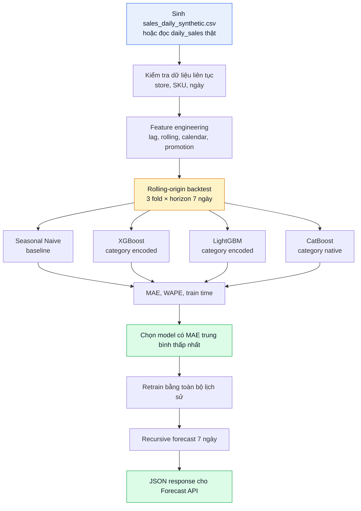

# HƯỚNG DẪN BENCHMARK FORECAST: XGBOOST · LIGHTGBM · CATBOOST

## 1. Mục tiêu

Notebook `notebooks/forecast_gbdt_benchmark.ipynb` chứng minh pipeline Forecast Agent chạy được từ đầu đến cuối:

1. Sinh dữ liệu doanh số mẫu theo ngày.
2. Biến lịch sử bán hàng thành bảng feature thời gian.
3. Benchmark XGBoost, LightGBM và CatBoost công bằng.
4. Chọn model có MAE trung bình thấp nhất qua backtest.
5. Sinh forecast 7 ngày và JSON để API sau này trả cho Dashboard/Orchestrator.

> Dữ liệu hiện tại là dữ liệu **mô phỏng có seed cố định**, chỉ dùng để chứng minh kỹ thuật. Khi có dữ liệu thật, thay `sales_daily_synthetic.csv` bằng dữ liệu tổng hợp từ `receipts` và `receipt_items`, sau đó chạy benchmark lại để chọn model triển khai.

---

## 2. Bài toán Forecast

Hệ thống dự báo số lượng một sản phẩm sẽ bán tại một cửa hàng trong N ngày tới.

```text
Input:  store_id=1, sku=COCA_330, horizon=7
Output: lượng Coca-Cola dự kiến bán mỗi ngày và tổng 7 ngày tới
```

Nguồn dữ liệu ở hệ thống hoàn chỉnh:

```text
Ảnh hóa đơn
    → Ingestion
    → receipts + receipt_items trong PostgreSQL
    → GROUP BY receipt_date, store_id, product_id
    → daily_sales(date, store_id, sku, category, qty)
    → Forecast Agent
```

Mỗi dòng dữ liệu train là một tổ hợp `(ngày, cửa hàng, SKU)`:

| date | store_id | sku | category | qty | promotion_flag |
|---|---|---|---|---:|---:|
| 2026-03-01 | STORE_01 | COCA_330 | BEVERAGE | 31 | 0 |
| 2026-03-02 | STORE_01 | COCA_330 | BEVERAGE | 35 | 1 |

---

## 3. Vì sao cần feature engineering?

XGBoost, LightGBM và CatBoost là model học từ **bảng dữ liệu**. Chúng không tự biết ngày hôm qua, tuần trước hay thứ bảy có ảnh hưởng đến doanh số thế nào.

Vì vậy notebook tạo các feature chỉ dùng thông tin có trước ngày cần dự báo:

| Feature | Ý nghĩa |
|---|---|
| `lag_1` | Lượng bán ngày hôm qua |
| `lag_7` | Lượng bán cùng thứ tuần trước |
| `lag_14` | Lượng bán cùng thứ hai tuần trước |
| `roll_mean_7` | Trung bình 7 ngày trước đó |
| `roll_std_7` | Mức biến động 7 ngày trước đó |
| `weekday` | Thứ trong tuần |
| `is_weekend` | Có phải cuối tuần |
| `promotion_flag` | Có khuyến mãi trong ngày |
| `store_id`, `sku`, `category` | Đặc điểm cửa hàng và sản phẩm |

Mọi lag và rolling mean đều được `shift(1)` trước khi dùng. Nếu không shift, feature ngày hôm nay sẽ nhìn thấy `qty` thật của chính ngày hôm nay — đó là **target leakage**, khiến metric đẹp giả tạo.

---

## 4. Gradient Boosting là gì?

Ba model so sánh đều thuộc họ **Gradient Boosted Decision Trees (GBDT)**.

Một cách hiểu đơn giản:

```text
Cây đầu tiên dự báo doanh số.
      ↓
Tính phần dự báo sai.
      ↓
Cây tiếp theo học để sửa phần sai đó.
      ↓
Lặp nhiều cây nhỏ.
      ↓
Cộng dự báo của các cây thành kết quả cuối.
```

Chúng phù hợp với retail forecasting vì có thể học quan hệ phi tuyến giữa lag, thứ trong tuần, cửa hàng, SKU và khuyến mãi.

### 4.1. XGBoost

**XGBoost** là phiên bản GBDT phổ biến và ổn định.

- Xây cây theo kiểu **level-wise**: mở rộng khá đồng đều theo từng tầng.
- Có regularization L1/L2 rõ ràng, giúp hạn chế overfit.
- `store_id`, `sku`, `category` phải được mã hóa số trước khi đưa vào model trong notebook.
- Dùng làm mốc GBDT chuẩn để đối chiếu.

### 4.2. LightGBM

**LightGBM** tối ưu mạnh về tốc độ và bộ nhớ.

- Dùng histogram binning để train nhanh.
- Xây cây **leaf-wise**: ưu tiên mở rộng lá làm giảm loss nhiều nhất.
- Phù hợp khi hệ thống có nhiều cửa hàng × nhiều SKU × nhiều ngày.
- Cần giới hạn độ phức tạp (`num_leaves`, `min_child_samples`) vì leaf-wise có thể overfit trên chuỗi ngắn.

### 4.3. CatBoost

**CatBoost** được thiết kế để xử lý biến phân loại.

- Nhận trực tiếp `store_id`, `sku`, `category` dạng chuỗi/category, ít cần encode thủ công.
- Ordered boosting và ordered target statistics giúp giảm overfit/leakage khi dùng category nhiều mức.
- Phù hợp khi train một **global model** dùng chung cho nhiều SKU và cửa hàng.
- Thường train chậm hơn LightGBM, nhưng có thể lợi thế khi category quan trọng.

| Tiêu chí | XGBoost | LightGBM | CatBoost |
|---|---|---|---|
| Cách xây boost trees | Level-wise | Leaf-wise | Ordered boosting |
| Tốc độ train | Trung bình | Nhanh | Trung bình/chậm |
| Category | Encode trước | Có hỗ trợ | Native, mạnh nhất |
| Điểm mạnh | Ổn định, regularization | Tốc độ, scale | SKU/store/category |
| Vai trò benchmark | Mốc GBDT | So sánh tốc độ/accuracy | So sánh category native |

---

## 5. Luồng notebook



### Seasonal Naive là gì và tại sao bắt buộc có?

Baseline này dự báo doanh số ngày hôm nay bằng doanh số của **cùng thứ tuần trước**:

```text
Dự báo Thứ Hai tuần tới = lượng bán Thứ Hai tuần này.
```

Nếu GBDT không tốt hơn baseline này, không có cơ sở nói model ML tạo ra giá trị thêm.

---

## 6. Đánh giá công bằng

Notebook dùng chung:

- cùng `sales_daily_synthetic.csv`;
- cùng horizon 7 ngày;
- cùng các mốc backtest;
- cùng feature số cho XGBoost và LightGBM;
- cùng MAE/WAPE để xếp hạng.

### Không random train/test split

Không được xáo trộn dữ liệu thời gian, vì train có thể nhìn thấy tương lai và dẫn đến kết quả không thật. Notebook dùng **rolling-origin backtest**:

```text
Fold 1: train đến ngày T1 → forecast 7 ngày tiếp theo
Fold 2: train đến ngày T2 → forecast 7 ngày tiếp theo
Fold 3: train đến ngày T3 → forecast 7 ngày tiếp theo
```

Mỗi forecast 7 ngày được sinh **recursive**: dự báo ngày t+2 dùng dự báo của ngày t+1, không dùng số thực tế trong test làm lag. Đây là mô phỏng sát cách API thật chạy.

### Metric

| Metric | Công thức / ý nghĩa |
|---|---|
| MAE | Trung bình `abs(thực tế - dự báo)`, cho biết lệch bao nhiêu đơn vị/ngày |
| WAPE | `sum(abs(thực tế - dự báo)) / sum(thực tế)`, dễ đọc dưới dạng phần trăm tổng sai số |
| Train time | Thời gian train, dùng làm chỉ số vận hành phụ |

Không dùng MAPE làm metric chính, vì nhiều ngày bán bằng 0 có thể làm mẫu số bằng 0 và metric bị méo.

---

## 7. Cách chọn model

Không chọn model vì tên hoặc vì kỳ vọng từ trước.

1. Chạy đủ các fold của Seasonal Naive, XGBoost, LightGBM và CatBoost.
2. Tính MAE/WAPE trung bình giữa các fold.
3. Chọn model có **MAE trung bình nhỏ nhất**.
4. Kiểm tra model thắng Seasonal Naive. Nếu không thắng, cần giữ Seasonal Naive hoặc xem lại feature/data.
5. Retrain model thắng trên toàn bộ lịch sử trước khi forecast qua API.

Kết quả synthetic data không được dùng để khẳng định thuật toán nào luôn tốt nhất. Khi có dữ liệu hoá đơn thật, nhóm phải chạy lại cùng notebook để chốt model production.

---

## 8. Contract Forecast API đề xuất

```http
GET /api/forecast?sku=COCA_330&store_id=STORE_01&horizon=7
```

```json
{
  "sku": "COCA_330",
  "store_id": "STORE_01",
  "horizon_days": 7,
  "method": "catboost",
  "history_days": 210,
  "predicted_quantity": 232.4,
  "daily_forecasts": [
    {"date": "2026-10-01", "predicted_quantity": 31.2},
    {"date": "2026-10-02", "predicted_quantity": 33.7}
  ],
  "evaluation": {
    "mae_backtest": 4.2,
    "wape_backtest": 0.151
  },
  "data_source": "sales_daily_synthetic.csv"
}
```

Sau khi tích hợp PostgreSQL, thay `data_source` bằng `postgresql_daily_sales`; shape response và ý nghĩa các trường không thay đổi.
